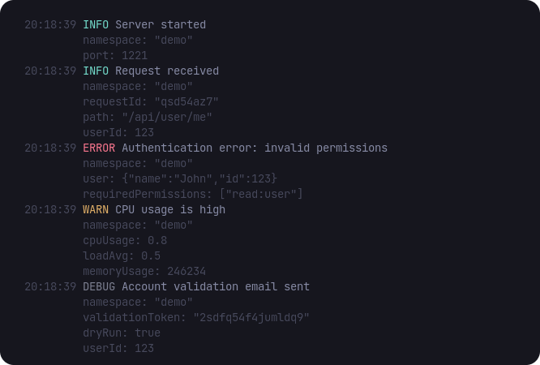

# Pretty Logging

The [`@crowlog/pretty`](https://www.npmjs.com/package/@crowlog/pretty) CLI formats JSON logs for human-readable output during development. It's inspired by the popular [`pino-pretty`](https://github.com/pinojs/pino-pretty) but tailored for Crowlog with minimalism and performance in mind.

## Installation

Install globally or use npx:

::: code-group

```bash [npx]
node app.js | npx crowlog-pretty
```

```bash [pnpm]
pnpm install -g @crowlog/pretty
```

```bash [npm]
npm install -g @crowlog/pretty
```

```bash [yarn]
yarn global add @crowlog/pretty
```

:::

## Usage

Pipe JSON logs through the pretty formatter:

```bash
# Node.js
node index.js | npx crowlog-pretty

# tsx
tsx watch index.ts | npx crowlog-pretty

# From file
cat logs.jsonl | npx crowlog-pretty

# PM2
pm2 logs --raw | npx crowlog-pretty
```

## Features

- **Colored output**: Different colors for each log level
- **Timestamp formatting**: Human-readable timestamps
- **Data formatting**: Pretty-printed JSON data
- **Namespace highlighting**: Easy to spot log sources
- **Error stack traces**: Formatted for readability

## Example Output

Here's an example of pretty-printed logs:



## Development Workflow

Use pretty logging in development:

::: code-group

```json [package.json]
{
  "scripts": {
    "dev": "tsx watch src/index.ts | crowlog-pretty",
    "build": "...",
    "start": "node dist/index.js"
  }
}
```

:::

```bash
# Development: pretty logs
pnpm dev

# Production: JSON logs
pnpm start
```
