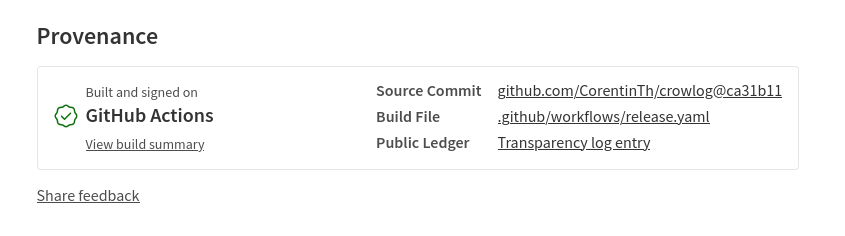

# Secure publishing

The Crowlog official packages are published using npm/github [Trusted Publishers](https://docs.npmjs.com/trusted-publishers) feature to ensure authenticity and integrity.

This means that when you install a Crowlog package, you can be confident that it has not been tampered with and is indeed published by the Crowlog team, in the repository [CorentinTh/crowlog](https://github.com/CorentinTh/crowlog) CI.

Here is an example of the provenance information for the package `@crowlog/logger` version `2.2.0`:

The publishing process is automated using GitHub Actions, which builds the packages, runs tests, and publishes them to npm when a new release is created.
