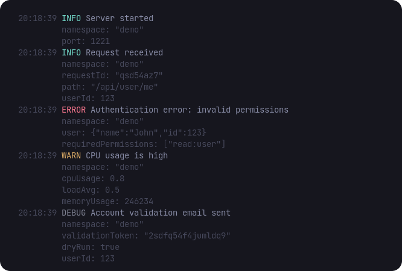

# Crowlog - Pretty

This package is a CLI tool to pretty print the logs of a [Crowlog logger](https://github.com/CorentinTh/crowlog/tree/main/packages/logger).



## Installation

```bash
# pnpm 
pnpm install -D @crowlog/pretty

# npm
npm install -D @crowlog/pretty

# yarn
yarn add -D @crowlog/pretty
```

## Usage

Just pipe the logs to the `crowlog-pretty` command:

```bash
# using node
node index.js | npx crowlog-pretty

# using tsx
tsx watch index.ts | npx crowlog-pretty
```

Or in your `package.json`:

```json5
"scripts": {
  // using node
  "dev": "node index.js | crowlog-pretty",
  // using tsx
  "dev": "tsx watch index.ts | crowlog-pretty",
},
```

## Contributing

This project is open to contributions. If you have any suggestions, please open an issue or a PR.

## License

This project is licensed under the MIT License. See the [LICENSE](./LICENSE) file for more information.

## Credits 

This project is crafted with ❤️ by [Corentin Thomasset](https://corentin.tech).
If you find this project helpful, please consider [supporting my work](https://buymeacoffee.com/cthmsst).
